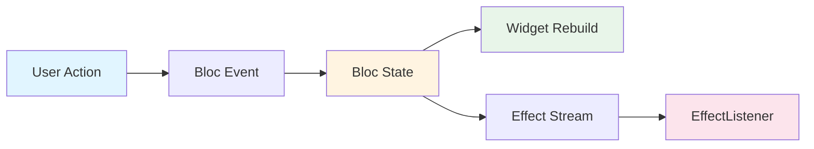
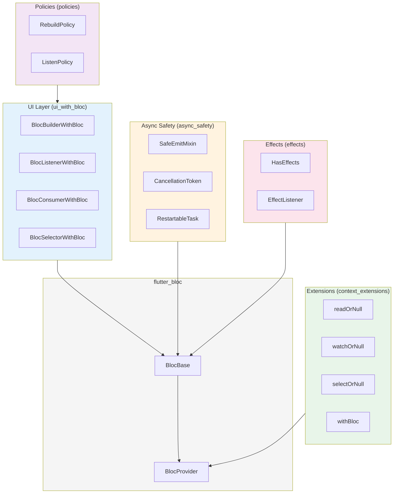
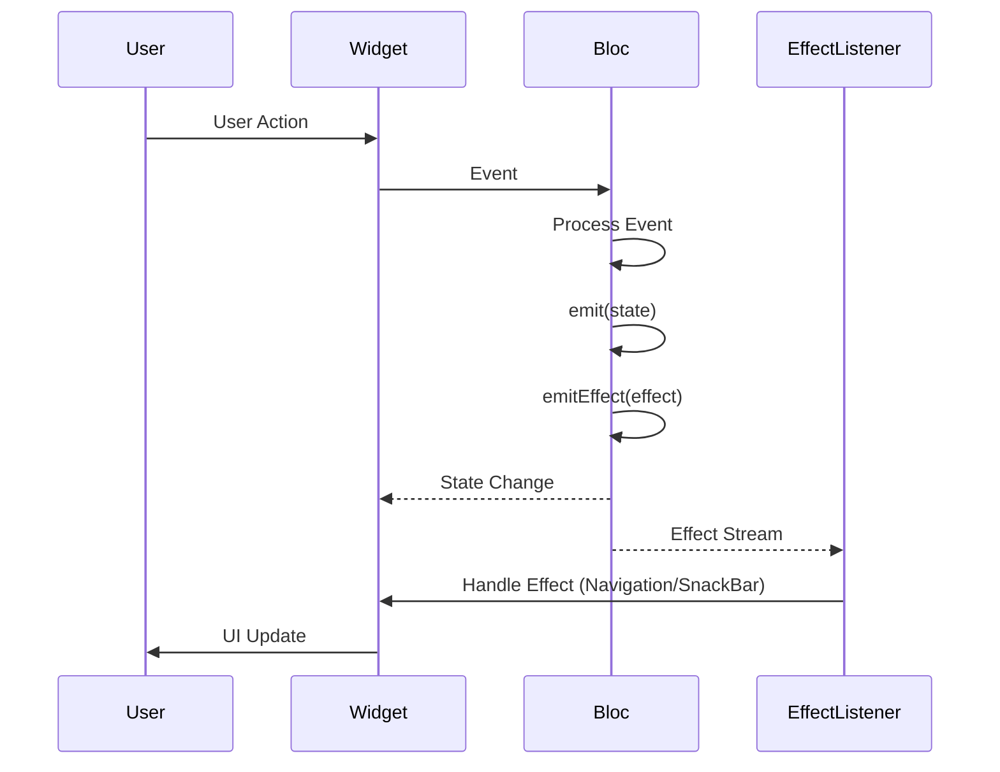

# Product Requirements Document

# Product Name: bloc_plus

------------------------------------------------------------------------

## 1. Overview

### 1.1 Purpose

`bloc_plus` is a Flutter package extending `flutter_bloc` with:

-   UI widgets that expose the underlying Bloc/Cubit instance directly
    in callbacks
-   Async safety utilities to prevent common lifecycle-related crashes
-   Effect handling primitives for one-shot UI events
-   Optional rebuild/listen policies to reduce boilerplate and increase
    correctness

The package must be:

-   Fully compatible with `flutter_bloc` and can be used alongside it
-   Zero magic, minimal abstraction overhead
-   Fully type-safe
-   Production-grade
-   Lightweight (no heavy dependencies)

------------------------------------------------------------------------

## 2. Problem Statement

In real-world Flutter BLoC projects:

1.  `BlocBuilder`/`BlocListener` do not expose the bloc instance in
    callbacks.
2.  Async operations often cause post-close emit crashes.
3.  One-shot effects (navigation/snackbars) pollute state models.
4.  Rebuild/listen logic is repeatedly implemented via lambdas.

------------------------------------------------------------------------

## 3. Goals

### 3.1 Primary Goals

-   Improve UI ergonomics
-   Improve async correctness
-   Provide clean effect architecture
-   Maintain full compatibility with flutter_bloc

### 3.2 Non-Goals

-   Not replacing flutter_bloc
-   Not creating a new state management framework
-   Not enforcing architecture patterns

### 3.3 Delivered Expansion Goals

After the initial `v0.x` baseline, the package adds targeted ergonomic
improvements that preserve the lightweight design:

-   Compose rebuild/listen policies instead of relying on ad-hoc predicates
-   Support custom equality for selector-based policy decisions
-   Improve effect handling ergonomics with filtering and flatter listener
    composition
-   Add higher-level async helpers for common restartable workflows
-   Evaluate a combined state-and-effect consumer only if it remains explicit
    and low-magic

------------------------------------------------------------------------

## 4. Technical Requirements

### 4.1 Environment Requirements

-   **Flutter**: >=3.10.0
-   **Dart**: >=3.0.0 <4.0.0
-   **Null Safety**: Required (sound null safety)

### 4.2 Dependencies

-   **flutter_bloc**: >=9.0.0, <10.0.0
-   **bloc**: >=9.0.0, <10.0.0
-   No additional heavy dependencies

### 4.3 Platform Support

-   **iOS**: Supported (iOS 11+)
-   **Android**: Supported (API level 21+)
-   **Web**: Supported
-   **Windows**: Supported
-   **macOS**: Supported
-   **Linux**: Supported

### 4.4 Compatibility

-   Compatible with public `flutter_bloc` APIs in supported versions
-   Can be used alongside existing `flutter_bloc` widgets
-   Does not modify or monkey-patch `flutter_bloc` runtime behavior
-   Backward compatible with existing BLoC patterns

### 4.5 Package Bootstrap (Required)

Before implementing any module, the agent MUST ensure the repository is a valid Flutter package scaffold.

-   If package scaffold is missing, create it with:
    -   `flutter create --template=package bloc_plus` (when running from parent directory)
    -   `flutter create --template=package .` (when already in package root)
-   For this repository layout, prefer `flutter create --template=package .` to avoid nested `bloc_plus/bloc_plus`.
-   Do not start module implementation before scaffold exists.
-   Required baseline artifacts after bootstrap:
    -   `pubspec.yaml`
    -   `lib/bloc_plus.dart`
    -   `test/`
    -   `example/`
-   Immediately after scaffold creation:
    -   Add `flutter_bloc` and `bloc` constraints from section 4.2
    -   Run `flutter pub get`
    -   Run `flutter analyze` once to validate clean baseline

### 4.6 Package Metadata & Publish Readiness

The agent should treat these as required package deliverables:

-   `pubspec.yaml` includes:
    -   `name: bloc_plus`
    -   SDK constraints aligned with section 4.1
    -   `flutter_bloc` and `bloc` dependency constraints from section 4.2
    -   package metadata (`description`, `homepage` or `repository`, `issue_tracker`)
-   Required top-level files:
    -   `README.md`
    -   `CHANGELOG.md`
    -   `LICENSE`
    -   `analysis_options.yaml`
-   Public entrypoint:
    -   `lib/bloc_plus.dart` exports only intended public APIs

------------------------------------------------------------------------

## 5. Architecture & Design Decisions

### 5.1 Design Philosophy

`bloc_plus` follows these principles:

1.  **Zero Magic**: No hidden behavior, all operations are explicit
2.  **Minimal Abstraction**: Thin wrappers around `flutter_bloc` widgets
3.  **Type Safety**: Full compile-time type checking
4.  **Composability**: All features can be used independently
5.  **Performance**: Minimal overhead with benchmark-backed acceptance thresholds

### 5.2 Module Independence

Each module (`ui_with_bloc`, `policies`, `context_extensions`, `async_safety`, `effects`) is independent and can be used separately:
-   `ui_with_bloc` (UI widgets) can be used without other modules
-   `policies` works with both standard and "WithBloc" widgets
-   `context_extensions` is standalone utility
-   `async_safety` is optional mixin/utilities set
-   `effects` requires bloc implementation but is independent

### 5.3 Data Flow



### 5.4 Architecture Overview



### 5.5 Effect Flow



### 5.6 API Contract Before Code Generation

The coding agent MUST treat this section as binding over illustrative snippets in the document.

-   Public API changes require PRD update first.
-   All APIs in this document are declarative contracts, not implementation inheritance requirements.
-   The implementation MUST use only public APIs from `flutter_bloc`/`bloc` in supported versions.
-   Any API that depends on private/undocumented framework internals is out of scope.
-   If a required behavior is impossible with public APIs, implementation must fail fast with a clear TODO in PR and a PRD amendment request.

**API Freeze Table (v0.x scope)**

| Symbol                             | Status | Contract Notes                                                                    |
|------------------------------------|--------|-----------------------------------------------------------------------------------|
| `BlocBuilderWithBloc`              | stable | `builder(context, bloc, state)`; parity with `BlocBuilder` semantics              |
| `BlocListenerWithBloc`             | stable | `listener(context, bloc, state)`; parity with `BlocListener` semantics            |
| `BlocConsumerWithBloc`             | stable | Combines builder/listener with independent conditions                             |
| `BlocSelectorWithBloc`             | stable | Selects `T` and rebuilds on selected value inequality by default                  |
| `RebuildPolicy`                    | stable | Stateless predicate object with composition helpers and explicit predicate wrappers |
| `ListenPolicy`                     | stable | Stateless predicate object with composition helpers and explicit predicate wrappers |
| `BuildContext` nullable extensions | stable | Return `null` on missing provider, never throw provider-not-found                 |
| `SafeEmitMixin`                    | stable | Silent no-op on closed bloc for `safeEmit`                                        |
| `CancellationToken`                | stable | Cooperative cancellation marker (does not force interrupt)                        |
| `RestartableTask`                  | stable | New run invalidates previous result; does not force interrupt underlying `Future` |
| `RestartableTasksMixin`            | stable | Keyed latest-result-wins helper for Cubits/Blocs with cooperative cancellation    |
| `HasEffects` + `EffectListener`    | stable | One-shot effect stream separated from state stream; supports effect filtering      |
| `MultiEffectListener`              | stable | Composes multiple effect listeners without manual nesting                         |
| `BlocConsumerWithEffects`          | stable | Combines state builder/listener callbacks with effect handling                    |

### 5.7 Agent Execution Sequence (Required)

The coding agent should execute work in this exact order:

1.  Bootstrap package scaffold (section 4.5).
2.  Apply dependency constraints (`flutter_bloc`, `bloc`) and run `flutter pub get`.
3.  Implement `ui_with_bloc` and `context_extensions` (M1 scope).
4.  Implement `policies`.
5.  Implement `async_safety`.
6.  Implement `effects`.
7.  Run full validation: format, analyze, tests.
8.  Update documentation and example app for implemented modules.

### 5.8 Implemented Expansion Track

The items below were delivered as additive public APIs after the initial
baseline contract.

| Delivered addition | Motivation | Design guardrail |
|--------------------|------------|------------------|
| Composable policies (`and`, `or`, `not`, `whenRebuild`, `whenListen`) | Reduce repeated inline `buildWhen` / `listenWhen` lambdas | Remain stateless and directly usable with `flutter_bloc` predicates |
| Selector policies with custom equality | Support lists, maps, DTOs, and derived values without relying only on `!=` | Equality stays explicit, with no hidden caching |
| Effect filtering via `effectWhen` | Keep `EffectListener` callbacks small and focused | Filtering remains transparent and type-safe |
| `MultiEffectListener` | Avoid deeply nested effect listeners | Follows established composition ergonomics |
| `RestartableTasksMixin` | Make `RestartableTask` easier to use in Cubits/Blocs | Keeps cooperative cancellation semantics explicit |
| `BlocConsumerWithEffects` | Simplify common screen wiring | Keeps state and effects semantically separate |

------------------------------------------------------------------------

# MODULE ui_with_bloc --- UI Layer Enhancements

## BlocBuilderWithBloc

Alternative widget to `BlocBuilder` that provides bloc instance directly in builder callback. Can be used alongside standard `flutter_bloc` widgets.

### API Specification

```dart
class BlocBuilderWithBloc<B extends BlocBase<S>, S> extends BlocBuilderBase<B, S> {
  const BlocBuilderWithBloc({
    Key? key,
    B? bloc,
    BlocBuilderCondition<S>? buildWhen,
    required Widget Function(BuildContext context, B bloc, S state) builder,
  }) : super(key: key, bloc: bloc, buildWhen: buildWhen);

  @override
  Widget build(BuildContext context, S state);
}
```

### Parameters

-   `bloc` (optional): The bloc instance to use. If not provided, will be looked up via `context.read<B>()`
-   `buildWhen` (optional): Condition function to determine if rebuild is needed
-   `builder`: Required builder function with signature `(context, bloc, state) -> Widget`

### Behavior

-   If `bloc` is null and not found in context, throws `ProviderNotFoundException`
-   Builder receives both bloc instance and current state
-   Rebuild behavior matches `BlocBuilder` exactly
-   Full type safety maintained

### Example Usage

```dart
BlocBuilderWithBloc<CounterBloc, CounterState>(
  builder: (context, bloc, state) {
    return Column(
      children: [
        Text('Count: ${state.count}'),
        ElevatedButton(
          onPressed: () => bloc.add(IncrementEvent()),
          child: Text('Increment'),
        ),
      ],
    );
  },
)
```

------------------------------------------------------------------------

## BlocListenerWithBloc

Alternative widget to `BlocListener` that provides bloc instance directly in listener callback. Can be used alongside standard `flutter_bloc` widgets.

### API Specification

```dart
class BlocListenerWithBloc<B extends BlocBase<S>, S> extends BlocListenerBase<B, S> {
  const BlocListenerWithBloc({
    Key? key,
    B? bloc,
    BlocListenerCondition<S>? listenWhen,
    required void Function(BuildContext context, B bloc, S state) listener,
    Widget? child,
  }) : super(key: key, bloc: bloc, listenWhen: listenWhen, child: child);

  @override
  void listen(BuildContext context, S state);
}
```

### Parameters

-   `bloc` (optional): The bloc instance to use. If not provided, will be looked up via `context.read<B>()`
-   `listenWhen` (optional): Condition function to determine if listener should be called
-   `listener`: Required listener function with signature `(context, bloc, state) -> void`
-   `child` (optional): Child widget to render

### Behavior

-   If `bloc` is null and not found in context, throws `ProviderNotFoundException`
-   Listener receives both bloc instance and current state
-   Listen behavior matches `BlocListener` exactly
-   Listener is called once per state change when `listenWhen` returns true

### Example Usage

```dart
BlocListenerWithBloc<AuthBloc, AuthState>(
  listenWhen: (previous, current) => previous.isAuthenticated != current.isAuthenticated,
  listener: (context, bloc, state) {
    if (state.isAuthenticated) {
      Navigator.pushReplacementNamed(context, '/home');
    } else {
      Navigator.pushReplacementNamed(context, '/login');
    }
  },
  child: MyWidget(),
)
```

------------------------------------------------------------------------

## BlocConsumerWithBloc

Combines `BlocBuilderWithBloc` and `BlocListenerWithBloc` functionality.

### API Specification

```dart
class BlocConsumerWithBloc<B extends BlocBase<S>, S> extends StatelessWidget {
  const BlocConsumerWithBloc({
    Key? key,
    B? bloc,
    BlocBuilderCondition<S>? buildWhen,
    BlocListenerCondition<S>? listenWhen,
    required void Function(BuildContext context, B bloc, S state) listener,
    required Widget Function(BuildContext context, B bloc, S state) builder,
  });
}
```

### Parameters

-   `bloc` (optional): The bloc instance to use
-   `buildWhen` (optional): Condition for rebuilds
-   `listenWhen` (optional): Condition for listener calls
-   `listener`: Required listener function
-   `builder`: Required builder function

### Behavior

-   Combines listener and builder functionality
-   Both callbacks receive bloc instance
-   Independent conditions for listening and building

### Example Usage

```dart
BlocConsumerWithBloc<CounterBloc, CounterState>(
  listenWhen: (previous, current) => current.count == 10,
  listener: (context, bloc, state) {
    ScaffoldMessenger.of(context).showSnackBar(
      SnackBar(content: Text('Reached 10!')),
    );
  },
  builder: (context, bloc, state) {
    return Text('Count: ${state.count}');
  },
)
```

------------------------------------------------------------------------

## BlocSelectorWithBloc

Alternative widget to `BlocSelector` that provides bloc instance directly and avoids unnecessary rebuilds. Can be used alongside standard `flutter_bloc` widgets.

### API Specification

```dart
class BlocSelectorWithBloc<B extends BlocBase<S>, S, T> extends StatelessWidget {
  const BlocSelectorWithBloc({
    Key? key,
    B? bloc,
    required T Function(S state) selector,
    bool Function(T previous, T current)? selectorShouldRebuild,
    required Widget Function(BuildContext context, B bloc, T selected) builder,
  });
}
```

### Parameters

-   `bloc` (optional): The bloc instance to use
-   `selector`: Required function to select value from state: `(S state) -> T`
-   `selectorShouldRebuild` (optional): Condition to determine if rebuild needed based on selected value
-   `builder`: Required builder function with signature `(context, bloc, selected) -> Widget`

### Behavior

-   Only rebuilds when selected value changes (by default uses `==` comparison)
-   Builder receives bloc instance and selected value (not full state)
-   Optimized for performance when only part of state is needed

### Example Usage

```dart
BlocSelectorWithBloc<CounterBloc, CounterState, int>(
  selector: (state) => state.count,
  builder: (context, bloc, count) {
    return Text('Count: $count');
  },
)
```

------------------------------------------------------------------------

# MODULE policies --- Policies

## RebuildPolicy

Abstract policy for controlling when widgets should rebuild based on state changes.

### API Specification

```dart
abstract class RebuildPolicy<S> {
  const RebuildPolicy();

  bool shouldRebuild(S previous, S current);
}
```

Built-in policies are exposed as top-level factory functions:
```dart
RebuildPolicy<S> distinct<S>();
RebuildPolicy<S> onChange<S, T>(T Function(S state) selector);
RebuildPolicy<S> always<S>();
RebuildPolicy<S> never<S>();
```

### Built-in Policies

#### distinct()

Only rebuilds when state changes (using `!=` comparison).

```dart
distinct<S>();
```

**Behavior**: Returns `true` when `previous != current`, `false` otherwise.

#### onChange<T>(selector)

Rebuilds when selected value changes.

```dart
onChange<S, T>(T Function(S state) selector);
```

**Parameters**:
-   `selector`: Function to extract value from state

**Behavior**: Returns `true` when `selector(previous) != selector(current)`.

**Example**:
```dart
onChange<CounterState, int>((state) => state.count)
```

#### always()

Always rebuilds on every state change.

```dart
always<S>();
```

**Behavior**: Always returns `true`.

#### never()

Never rebuilds (useful for listeners only).

```dart
never<S>();
```

**Behavior**: Always returns `false`.

### Custom Policy Example

```dart
class CustomRebuildPolicy<S> extends RebuildPolicy<S> {
  @override
  bool shouldRebuild(S previous, S current) {
    // Custom logic
    return previous.hashCode != current.hashCode;
  }
}
```

### Usage with Widgets

```dart
BlocBuilderWithBloc<CounterBloc, CounterState>(
  buildWhen: distinct<CounterState>().shouldRebuild,
  builder: (context, bloc, state) => Text('${state.count}'),
)
```

------------------------------------------------------------------------

## ListenPolicy

Abstract policy for controlling when listeners should be called based on state changes.

### API Specification

```dart
abstract class ListenPolicy<S> {
  const ListenPolicy();

  bool shouldListen(S previous, S current);
}
```

Built-in policies are exposed as top-level factory functions:
```dart
ListenPolicy<S> distinctListen<S>();
ListenPolicy<S> onChangeListen<S, T>(T Function(S state) selector);
ListenPolicy<S> alwaysListen<S>();
ListenPolicy<S> neverListen<S>();
```

### Built-in Policies

Listen variants of rebuild policies:
-   `distinctListen()`: Listen only when state changes
-   `onChangeListen<T>(selector)`: Listen when selected value changes
-   `alwaysListen()`: Always listen
-   `neverListen()`: Never listen

### Usage Example

```dart
BlocListenerWithBloc<AuthBloc, AuthState>(
  listenWhen: onChangeListen<AuthState, bool>(
    (state) => state.isAuthenticated,
  ).shouldListen,
  listener: (context, bloc, state) {
    // Only called when isAuthenticated changes
  },
)
```

------------------------------------------------------------------------

# MODULE context_extensions --- BuildContext Extensions

Extension methods on `BuildContext` providing null-safe access to bloc instances.

### API Specification

#### readOrNull<B>()

Safely reads a bloc instance without throwing if not found.

```dart
extension BlocContextExtension on BuildContext {
  B? readOrNull<B extends BlocBase<Object?>>();
}
```

**Returns**: The bloc instance of type `B`, or `null` if not found in widget tree.

**Behavior**: Never throws. Returns `null` if bloc is not provided in context.

**Example Usage**:
```dart
final bloc = context.readOrNull<CounterBloc>();
if (bloc != null) {
  bloc.add(IncrementEvent());
}
```

#### watchOrNull<B>()

Safely watches a bloc instance without throwing if not found.

```dart
extension BlocContextExtension on BuildContext {
  B? watchOrNull<B extends BlocBase<Object?>>();
}
```

**Returns**: The bloc instance of type `B`, or `null` if not found.

**Behavior**: 
-   Never throws
-   Rebuilds widget when bloc state changes
-   Returns `null` if bloc is not provided

**Example Usage**:
```dart
Widget build(BuildContext context) {
  final bloc = context.watchOrNull<CounterBloc>();
  if (bloc == null) return Text('Bloc not available');
  
  return BlocBuilder(
    bloc: bloc,
    builder: (context, state) => Text('${state.count}'),
  );
}
```

#### selectOrNull<B, T>(selector)

Safely selects a value from bloc state without throwing if not found.

```dart
extension BlocContextExtension on BuildContext {
  T? selectOrNull<B extends BlocBase<S>, S, T>(
    T Function(S state) selector,
  );
}
```

**Parameters**:
-   `selector`: Function to extract value from state

**Returns**: Selected value of type `T`, or `null` if bloc not found.

**Behavior**:
-   Never throws
-   Rebuilds widget only when selected value changes
-   Returns `null` if bloc is not provided

**Example Usage**:
```dart
Widget build(BuildContext context) {
  final count = context.selectOrNull<CounterBloc, CounterState, int>(
    (state) => state.count,
  );
  
  return Text('Count: ${count ?? 0}');
}
```

#### withBloc<B, R>(fn)

Executes a function with bloc instance, returning null if bloc not found.

```dart
extension BlocContextExtension on BuildContext {
  R? withBloc<B extends BlocBase<Object?>, R>(
    R Function(B bloc) fn,
  );
}
```

**Parameters**:
-   `fn`: Function to execute with bloc instance

**Returns**: Result of `fn(bloc)`, or `null` if bloc not found.

**Behavior**:
-   Never throws
-   Returns `null` if bloc is not provided
-   Useful for conditional bloc operations

**Example Usage**:
```dart
final result = context.withBloc<CounterBloc, String>(
  (bloc) => bloc.state.count.toString(),
);

if (result != null) {
  print('Count: $result');
}
```

### Edge Cases

-   All methods return `null` if bloc is not in widget tree
-   Methods are safe for missing providers, but must only be called with a valid live `BuildContext`
-   `watchOrNull` and `selectOrNull` will stop rebuilding if bloc is removed from tree

------------------------------------------------------------------------

# MODULE async_safety --- Async Safety

## SafeEmitMixin

Mixin providing safe emit operations that check if bloc is closed before emitting.

### API Specification

```dart
mixin SafeEmitMixin<S> on BlocBase<S> {
  void safeEmit(S state);
  
  Future<T?> guarded<T>(
    Future<T> Function() operation,
  );
}
```

### Methods

#### safeEmit(S state)

Safely emits a state only if bloc is not closed.

**Parameters**:
-   `state`: The state to emit

**Behavior**:
-   Checks if bloc is closed before emitting
-   Silently ignores emit if bloc is closed
-   Throws `StateError` if bloc is not initialized (same as standard `emit`)

**Example Usage**:
```dart
class CounterBloc extends Bloc<CounterEvent, CounterState> 
    with SafeEmitMixin<CounterState> {
  
  Future<void> loadData() async {
    final data = await repository.fetchData();
    // Safe even if bloc was closed during fetch
    safeEmit(CounterState(data: data));
  }
}
```

#### guarded<T>(operation)

Executes an async operation and safely emits state only if bloc is still open.

**Parameters**:
-   `operation`: Async function to execute

**Returns**: `Future<T?>` - Result of operation, or `null` if bloc was closed

**Behavior**:
-   Executes operation
-   If bloc is closed during operation, returns `null`
-   If bloc is still open, returns operation result
-   Prevents post-close state emissions

**Example Usage**:
```dart
class DataBloc extends Bloc<DataEvent, DataState> 
    with SafeEmitMixin<DataState> {
  
  Future<void> loadData() async {
    final result = await guarded(() => api.fetchData());
    if (result != null) {
      safeEmit(DataState(data: result));
    }
  }
}
```

------------------------------------------------------------------------

## CancellationToken

Token for cancelling async operations, useful for preventing post-close operations.

### API Specification

```dart
class CancellationToken {
  bool get isCancelled;
  
  void cancel();
  
  Future<T?> run<T>(
    Future<T> Function() task,
  );
}
```

### Properties

#### isCancelled

Returns `true` if token has been cancelled.

**Type**: `bool`

**Behavior**: Read-only property, set by `cancel()` method.

### Methods

#### cancel()

Marks the token as cancelled.

**Behavior**: 
-   Sets `isCancelled` to `true`
-   Cannot be uncancelled
-   Thread-safe

#### run<T>(task)

Executes a task and checks cancellation before completion.

**Parameters**:
-   `task`: Async function to execute

**Returns**: `Future<T?>` - Task result if not cancelled, `null` if cancelled

**Behavior**:
-   Executes task
-   If cancelled before task completes, returns `null`
-   If task completes before cancellation, returns result
-   Does not cancel running task, only prevents using result

**Example Usage**:
```dart
class DataBloc extends Bloc<DataEvent, DataState> {
  CancellationToken? _token;
  
  Future<void> loadData() async {
    _token?.cancel();
    _token = CancellationToken();
    
    final result = await _token!.run(() => api.fetchData());
    if (result != null && !_token!.isCancelled) {
      emit(DataState(data: result));
    }
  }
  
  @override
  Future<void> close() {
    _token?.cancel();
    return super.close();
  }
}
```

------------------------------------------------------------------------

## RestartableTask

Manages a restartable async task that automatically cancels previous task when new one starts.

### API Specification

```dart
class RestartableTask<T> {
  bool get isRunning;
  
  Future<T?> run(
    Future<T> Function() task,
  );
  
  void cancel();
  
  Future<void> dispose();
}
```

### Properties

#### isRunning

Returns `true` if task is currently running.

**Type**: `bool`

### Methods

#### run(task)

Starts a new task, cancelling any previously running task.

**Parameters**:
-   `task`: Async function to execute

**Returns**: `Future<T?>` - Task result, or `null` if cancelled

**Behavior**:
-   Cancels previous task if running
-   Starts new task
-   Returns result of new task
-   Previous task result is discarded

**Example Usage**:
```dart
class SearchBloc extends Bloc<SearchEvent, SearchState> {
  final _searchTask = RestartableTask<List<Item>>();
  
  Future<void> search(String query) async {
    final results = await _searchTask.run(() => api.search(query));
    if (results != null) {
      emit(SearchState(results: results));
    }
  }
  
  @override
  Future<void> close() {
    _searchTask.dispose();
    return super.close();
  }
}
```

#### cancel()

Cancels the currently running task.

**Behavior**:
-   Cancels task if running
-   No-op if no task running
-   Does not prevent starting new task

#### dispose()

Disposes the task manager and cancels any running task.

**Behavior**:
-   Cancels running task
-   Prevents new tasks from being started
-   Should be called in bloc's `close()` method

### Lifecycle Integration

```dart
class MyBloc extends Bloc<MyEvent, MyState> {
  final _task = RestartableTask<String>();
  
  Future<void> performOperation() async {
    final result = await _task.run(() => longRunningOperation());
    if (result != null) {
      emit(MyState(data: result));
    }
  }
  
  @override
  Future<void> close() {
    _task.dispose(); // Important: dispose in close()
    return super.close();
  }
}
```

------------------------------------------------------------------------

# MODULE effects --- Effects

## HasEffects

Mixin for blocs that emit one-shot effects (navigation, snackbars, dialogs) separate from state.

### API Specification

```dart
mixin HasEffects<E> on BlocBase<Object?> {
  Stream<E> get effects;
  
  void emitEffect(E effect);
}
```

### Properties

#### effects

Stream of effects emitted by the bloc.

**Type**: `Stream<E>`

**Behavior**:
-   Read-only stream
-   Broadcast stream (supports multiple listeners)
-   Emits effects as they occur
-   Effects are consumed once per listener subscription
-   Stream completes when bloc is closed
-   Delivery is non-replay by default (effects emitted before subscription are not replayed)

### Methods

#### emitEffect(E effect)

Emits a one-shot effect.

**Parameters**:
-   `effect`: The effect to emit

**Behavior**:
-   Emits effect to `effects` stream
-   Safe to call even if no listeners
-   Effects are separate from state, don't trigger rebuilds

### Implementation Example

```dart
// Define effect types
sealed class NavigationEffect {}
class NavigateToHome extends NavigationEffect {}
class NavigateToProfile extends NavigationEffect {}
class ShowSnackBar extends NavigationEffect {
  final String message;
  ShowSnackBar(this.message);
}

// Implement in bloc
class AuthBloc extends Bloc<AuthEvent, AuthState> 
    with HasEffects<NavigationEffect> {
  
  final _effectsController = StreamController<NavigationEffect>.broadcast();
  
  @override
  Stream<NavigationEffect> get effects => _effectsController.stream;
  
  void emitEffect(NavigationEffect effect) {
    _effectsController.add(effect);
  }
  
  Future<void> login(String email, String password) async {
    try {
      final user = await authService.login(email, password);
      emit(AuthState.authenticated(user));
      emitEffect(NavigateToHome()); // One-shot effect
    } catch (e) {
      emit(AuthState.error(e.toString()));
      emitEffect(ShowSnackBar('Login failed: $e')); // One-shot effect
    }
  }
  
  @override
  Future<void> close() {
    _effectsController.close();
    return super.close();
  }
}
```

### Benefits

-   **Separation of Concerns**: Effects don't pollute state model
-   **Type Safety**: Effects are strongly typed
-   **Testability**: Effects can be tested independently
-   **Clean State**: State only contains data, not UI concerns

------------------------------------------------------------------------

## EffectListener

Widget that listens to effect stream and executes callback once per effect emission.

### API Specification

```dart
class EffectListener<B extends BlocBase<Object?>, E> extends StatelessWidget {
  const EffectListener({
    Key? key,
    B? bloc,
    required void Function(BuildContext context, E effect) onEffect,
    Widget? child,
  }) : super(key: key);

  @override
  Widget build(BuildContext context);
}
```

### Parameters

-   `bloc` (optional): The bloc instance. If not provided, will be looked up via `context.read<B>()`
-   `onEffect`: Required callback function with signature `(context, effect) -> void`
-   `child` (optional): Child widget to render

### Behavior

-   Subscribes to bloc's `effects` stream
-   Calls `onEffect` callback once per effect emission
-   Automatically unsubscribes when widget is disposed
-   If bloc is null and not found, throws `ProviderNotFoundException`
-   Requires bloc to implement `HasEffects<E>`

### Example Usage

```dart
class LoginPage extends StatelessWidget {
  @override
  Widget build(BuildContext context) {
    return BlocProvider(
      create: (_) => AuthBloc(),
      child: EffectListener<AuthBloc, NavigationEffect>(
        onEffect: (context, effect) {
          switch (effect) {
            case NavigateToHome():
              Navigator.pushReplacementNamed(context, '/home');
            case NavigateToProfile():
              Navigator.pushNamed(context, '/profile');
            case ShowSnackBar(:final message):
              ScaffoldMessenger.of(context).showSnackBar(
                SnackBar(content: Text(message)),
              );
          }
        },
        child: LoginForm(),
      ),
    );
  }
}
```

### Multiple Effect Listeners

Multiple `EffectListener` widgets can listen to the same bloc:

```dart
EffectListener<AuthBloc, NavigationEffect>(
  onEffect: (context, effect) {
    // Handle navigation effects
  },
  child: EffectListener<AuthBloc, SnackBarEffect>(
    onEffect: (context, effect) {
      // Handle snackbar effects
    },
    child: MyWidget(),
  ),
)
```

### Cleanup

`EffectListener` automatically:
-   Unsubscribes from stream when widget is disposed
-   Handles bloc disposal gracefully
-   Prevents memory leaks

------------------------------------------------------------------------

## 6. Usage Guide

### 6.1 Using bloc_plus with flutter_bloc

`bloc_plus` is designed to be used alongside `flutter_bloc`, not as a replacement. You can freely mix widgets from both libraries in the same application. Both libraries work together seamlessly and share the same bloc instances.

### 6.2 When to use bloc_plus widgets

Use `bloc_plus` widgets when:
-   You need direct bloc instance access in callbacks (avoids `context.read()` calls)
-   You want null-safe extensions for optional blocs (`readOrNull`, `watchOrNull`, etc.)
-   You need async safety utilities (`SafeEmitMixin`, `CancellationToken`, `RestartableTask`)
-   You want to use the effects pattern (`HasEffects`, `EffectListener`)
-   You want to use rebuild/listen policies for cleaner code

Continue using `flutter_bloc` widgets when:
-   Existing code works well and doesn't need changes
-   You prefer the standard API
-   You don't need the additional features provided by `bloc_plus`
-   You want to maintain consistency with existing codebase

### 6.3 Mixing widgets in the same app

You can freely mix widgets from both libraries in the same application. They work with the same bloc instances provided via `BlocProvider`.

**Example: Using both libraries together**

```dart
class MyPage extends StatelessWidget {
  @override
  Widget build(BuildContext context) {
    return BlocProvider(
      create: (_) => CounterBloc(),
      child: Column(
        children: [
          // Using standard flutter_bloc widget
          BlocBuilder<CounterBloc, CounterState>(
            builder: (context, state) {
              return Text('Standard: ${state.count}');
            },
          ),
          
          // Using bloc_plus widget in the same tree
          BlocBuilderWithBloc<CounterBloc, CounterState>(
            builder: (context, bloc, state) {
              return ElevatedButton(
                onPressed: () => bloc.add(IncrementEvent()),
                child: Text('Plus: ${state.count}'),
              );
            },
          ),
        ],
      ),
    );
  }
}
```

### 6.4 Examples of combined usage

**Example 1: Gradual adoption**

Start using `bloc_plus` widgets in new features while keeping existing `flutter_bloc` widgets unchanged:

```dart
// Existing code - no changes needed
BlocBuilder<CounterBloc, CounterState>(
  builder: (context, state) => Text('${state.count}'),
)

// New feature - using bloc_plus
BlocBuilderWithBloc<CounterBloc, CounterState>(
  builder: (context, bloc, state) {
    return Column(
      children: [
        Text('${state.count}'),
        ElevatedButton(
          onPressed: () => bloc.add(IncrementEvent()),
          child: Text('Increment'),
        ),
      ],
    );
  },
)
```

**Example 2: Using extensions with standard widgets**

Use `bloc_plus` extensions (`readOrNull`, `watchOrNull`) with standard `flutter_bloc` widgets:

```dart
Widget build(BuildContext context) {
  // Using bloc_plus extension for null-safe access
  final bloc = context.readOrNull<CounterBloc>();
  if (bloc == null) return Text('Bloc not available');
  
  // Using standard flutter_bloc widget
  return BlocBuilder(
    bloc: bloc,
    builder: (context, state) => Text('${state.count}'),
  );
}
```

**Example 3: Using async safety with existing blocs**

Add `SafeEmitMixin` to existing blocs without changing widget usage:

```dart
// Bloc with async safety
class DataBloc extends Bloc<DataEvent, DataState> 
    with SafeEmitMixin<DataState> {
  
  Future<void> loadData() async {
    final data = await repository.fetchData();
    safeEmit(DataState(data: data)); // Safe emit
  }
}

// Can use with either widget type
BlocBuilder<DataBloc, DataState>(...) // Standard widget works
BlocBuilderWithBloc<DataBloc, DataState>(...) // Plus widget also works
```

### 6.5 Compatibility notes

-   All `bloc_plus` widgets work with blocs created using standard `flutter_bloc` patterns
-   All `flutter_bloc` widgets work with blocs that use `bloc_plus` mixins (`SafeEmitMixin`, `HasEffects`)
-   Both libraries use the same `BlocProvider` for dependency injection
-   No conflicts or breaking changes when mixing widgets
-   Full type safety maintained across both libraries
-   Both `Bloc` and `Cubit` types are supported via `BlocBase`-based contracts

------------------------------------------------------------------------

## 7. Error Handling

### 7.1 Widget Errors

#### ProviderNotFoundException

**When**: Bloc not found in widget tree and `bloc` parameter is null.

**Handling**: Always provide `bloc` parameter or ensure bloc is provided via `BlocProvider`.

**Example**:
```dart
// Safe: Explicit bloc
BlocBuilderWithBloc<CounterBloc, CounterState>(
  bloc: myBloc,
  builder: (context, bloc, state) => ...,
)

// Safe: Bloc in tree
BlocProvider(
  create: (_) => CounterBloc(),
  child: BlocBuilderWithBloc<CounterBloc, CounterState>(
    builder: (context, bloc, state) => ...,
  ),
)
```

### 7.2 Async Safety Errors

#### Post-Close Emit Prevention

**Problem**: Emitting state after bloc is closed causes crash.

**Solution**: Use `SafeEmitMixin`:
```dart
class MyBloc extends Bloc<MyEvent, MyState> 
    with SafeEmitMixin<MyState> {
  
  Future<void> loadData() async {
    final data = await api.fetchData();
    safeEmit(MyState(data: data)); // Safe, ignores if closed
  }
}
```

### 7.3 Effect Errors

#### Missing HasEffects Implementation

**When**: Using `EffectListener` with bloc that doesn't implement `HasEffects`.

**Handling**: Ensure bloc implements `HasEffects<E>` mixin.

**Example**:
```dart
// Correct implementation
class AuthBloc extends Bloc<AuthEvent, AuthState> 
    with HasEffects<NavigationEffect> {
  // ... implementation
}
```

### 7.4 Extension Errors

#### Null Returns

All extension methods (`readOrNull`, `watchOrNull`, etc.) return `null` if bloc not found.

**Handling**: Always check for null:
```dart
final bloc = context.readOrNull<CounterBloc>();
if (bloc == null) {
  // Handle missing bloc
  return;
}
bloc.add(SomeEvent());
```

### 7.5 Task Errors

#### RestartableTask Disposal

**Problem**: Forgetting to dispose `RestartableTask` in bloc's `close()`.

**Solution**: Always dispose in `close()`:
```dart
class MyBloc extends Bloc<MyEvent, MyState> {
  final _task = RestartableTask<String>();
  
  @override
  Future<void> close() {
    _task.dispose(); // Important!
    return super.close();
  }
}
```

### 7.6 Common Mistakes

1.  **Not checking null from extensions**: Always check `readOrNull()` result
2.  **Forgetting SafeEmitMixin**: Use for all async emits
3.  **Not disposing tasks**: Always dispose `RestartableTask` in `close()`
4.  **Missing HasEffects**: Implement `HasEffects` before using `EffectListener`
5.  **Mixing effect types**: Use separate effect types or separate listeners

------------------------------------------------------------------------

## 8. Edge Cases & Gotchas

### 8.1 Widget Lifecycle

#### Bloc Removed During Build

**Scenario**: Bloc is removed from tree while widget is building.

**Behavior**: 
-   `BlocBuilderWithBloc` throws `ProviderNotFoundException`
-   `readOrNull()` returns `null`
-   `watchOrNull()` stops rebuilding

**Best Practice**: Use `readOrNull()` for one-time reads, handle null case.

### 8.2 Async Operations

#### Multiple Concurrent Emits

**Scenario**: Multiple async operations complete after bloc is closed.

**Behavior with SafeEmitMixin**: All emits are silently ignored.

**Best Practice**: Use `guarded()` for operations that should be cancelled:
```dart
final result = await guarded(() => api.fetchData());
if (result != null) {
  safeEmit(MyState(data: result));
}
```

### 8.3 Effect Streams

#### Multiple Listeners

**Scenario**: Multiple `EffectListener` widgets listening to same bloc.

**Behavior**: Each listener receives all effects (broadcast stream).

**Best Practice**: Filter effects in listener callback or use separate effect types.

### 8.4 Policies

#### Policy Reuse

**Scenario**: Reusing same policy instance across multiple widgets.

**Behavior**: Policies are stateless, safe to reuse.

**Best Practice**: Create policy instances once and reuse:
```dart
final policy = distinct<CounterState>();

BlocBuilderWithBloc(..., buildWhen: policy.shouldRebuild);
BlocBuilderWithBloc(..., buildWhen: policy.shouldRebuild);
```

### 8.5 Selector Performance

#### Expensive Selectors

**Scenario**: Selector function performs expensive computation.

**Behavior**: Selector is called on every state change, even if result doesn't change.

**Best Practice**: Keep selectors lightweight, use `selectorShouldRebuild` for complex logic:
```dart
BlocSelectorWithBloc<DataBloc, DataState, ExpensiveResult>(
  selector: (state) => computeExpensive(state),
  selectorShouldRebuild: (previous, current) => 
    previous.dataHash != current.dataHash, // Only recompute when needed
  builder: (context, bloc, result) => ...,
)
```

### 8.6 CancellationToken Lifecycle

#### Token Cancellation Timing

**Scenario**: Cancelling token while task is running.

**Behavior**: Task continues running, but `run()` returns `null`.

**Best Practice**: Check `isCancelled` inside long-running tasks:
```dart
final result = await token.run(() async {
  for (var item in items) {
    if (token.isCancelled) break; // Check cancellation
    await processItem(item);
  }
});
```

------------------------------------------------------------------------

## 9. Performance Considerations

### 9.1 Widget Rebuilds

-   `BlocBuilderWithBloc` rebuilds same as `BlocBuilder` - no overhead
-   `BlocSelectorWithBloc` optimizes rebuilds by comparing selected values
-   Use `buildWhen` and `selectorShouldRebuild` to minimize rebuilds

### 9.2 Memory Usage

-   `EffectListener` automatically unsubscribes on dispose - no leaks
-   `RestartableTask` cancels previous tasks - prevents memory buildup
-   `SafeEmitMixin` adds minimal overhead (single boolean check)

### 9.3 Async Operations

-   `guarded()` adds minimal overhead (bloc state check)
-   `CancellationToken` is lightweight (single boolean flag)
-   `RestartableTask` manages single task reference

### 9.4 Best Practices

1.  Use `BlocSelectorWithBloc` when only part of state is needed
2.  Implement `buildWhen`/`listenWhen` to prevent unnecessary rebuilds
3.  Use policies for reusable rebuild logic
4.  Dispose tasks in bloc's `close()` method
5.  Use effects instead of state for one-shot UI events

------------------------------------------------------------------------

# Testing Requirements

## 10.1 Coverage Requirements

-   **Minimum Coverage**: ≥ 90% code coverage
-   **Critical Paths**: 100% coverage for async safety utilities
-   **Widget Tests**: All widgets must have widget tests
-   **Unit Tests**: All utilities and mixins must have unit tests

## 10.2 Test Categories

### Unit Tests

**Async Safety**:
-   `SafeEmitMixin.safeEmit()` ignores emits when bloc is closed
-   `SafeEmitMixin.guarded()` returns null when bloc is closed
-   `CancellationToken` cancellation works correctly
-   `RestartableTask` cancels previous task when new one starts
-   `RestartableTask.dispose()` prevents new tasks

**Policies**:
-   `distinct()` only rebuilds on state change
-   `onChange()` rebuilds on selected value change
-   `always()` always rebuilds
-   `never()` never rebuilds
-   Custom policies work correctly

**Extensions**:
-   `readOrNull()` returns null when bloc not found
-   `watchOrNull()` returns null when bloc not found
-   `selectOrNull()` returns null when bloc not found
-   `withBloc()` returns null when bloc not found
-   All extensions don't throw when bloc absent

**Effects**:
-   `HasEffects.emitEffect()` emits to stream
-   `HasEffects.effects` stream completes on bloc close
-   Effect stream is broadcast (multiple listeners)

### Widget Tests

**UI Widgets**:
-   `BlocBuilderWithBloc` rebuilds on state change
-   `BlocBuilderWithBloc` provides bloc instance to builder
-   `BlocListenerWithBloc` calls listener on state change
-   `BlocListenerWithBloc` provides bloc instance to listener
-   `BlocConsumerWithBloc` combines builder and listener
-   `BlocSelectorWithBloc` only rebuilds when selected value changes
-   Widgets throw `ProviderNotFoundException` when `bloc` is null and provider is missing

**EffectListener**:
-   `EffectListener` calls callback on effect emission
-   `EffectListener` unsubscribes on dispose
-   `EffectListener` handles multiple effects correctly
-   `EffectListener` handles bloc disposal gracefully

### Integration Tests

-   Widgets work correctly with `flutter_bloc` providers
-   Multiple widgets can use same bloc instance
-   Effects work correctly with multiple listeners
-   Async safety prevents crashes in real scenarios
-   Policies work correctly with all widget types

## 10.3 Test Examples

### Unit Test Example

```dart
test('SafeEmitMixin ignores emit when bloc is closed', () {
  final bloc = TestBloc();
  bloc.close();
  
  expect(() => bloc.safeEmit(TestState()), returnsNormally);
  expect(bloc.state, isNot(equals(TestState())));
});
```

### Widget Test Example

```dart
testWidgets('BlocBuilderWithBloc provides bloc instance', (tester) async {
  final counterBloc = CounterBloc();
  
  await tester.pumpWidget(
    BlocProvider.value(
      value: counterBloc,
      child: BlocBuilderWithBloc<CounterBloc, CounterState>(
        builder: (context, bloc, state) {
          expect(bloc, isNotNull);
          expect(bloc, same(counterBloc));
          return Text('${state.count}');
        },
      ),
    ),
  );
});
```

## 10.4 Performance Tests

-   Widget rebuild performance matches `flutter_bloc`
-   Selector performance is optimized
-   Effect emission has minimal overhead
-   Async safety checks have minimal overhead

## 10.5 CI Validation Gates (Required)

Each implementation PR must pass:

-   `dart format --set-exit-if-changed .`
-   `flutter analyze`
-   `flutter test`

------------------------------------------------------------------------

## 11. Documentation Requirements

### 11.1 API Documentation

All public APIs must have:
-   Dartdoc comments explaining purpose and usage
-   Parameter documentation
-   Return value documentation
-   Example code snippets
-   Thrown exceptions documentation

### 11.2 README Requirements

README must include:
-   Overview and purpose
-   Installation instructions
-   Quick start guide
-   Feature overview for each module
-   Usage guide showing how to use bloc_plus with flutter_bloc
-   Examples for common use cases
-   Links to detailed documentation

### 11.3 Example App

Must provide example app demonstrating:
-   All widget types
-   Async safety usage
-   Effects pattern
-   Policies usage
-   Extension methods
-   Common patterns and best practices

### 11.4 Documentation Structure

```
docs/
├── README.md (main documentation)
├── getting_started.md
├── usage_guide.md
├── widgets.md (ui_with_bloc)
├── policies.md (policies)
├── extensions.md (context_extensions)
├── async_safety.md (async_safety)
├── effects.md (effects)
└── examples/
    ├── basic_usage.dart
    ├── async_safety.dart
    ├── effects.dart
    └── policies.dart
```

## 11.5 Pre-Implementation Checklist (Required)

Before running a code-generation agent, all items below must be marked complete:

-   Flutter package scaffold exists (`pubspec.yaml`, `lib/`, `test/`, `example/`).
-   If scaffold did not exist, bootstrap command was executed:
    -   `flutter create --template=package bloc_plus` or `flutter create --template=package .`
-   Package metadata baseline exists (`README.md`, `CHANGELOG.md`, `LICENSE`, `analysis_options.yaml`).
-   API contracts verified against current `flutter_bloc` public API.
-   Each module has explicit acceptance criteria with at least one negative test case.
-   Error semantics are defined (`throw` vs `null` vs no-op) for every public method/widget.
-   Effects lifecycle ownership is explicit (controller creation, close order, late emit behavior).
-   Async cancellation semantics explicitly state cooperative model (no hard cancellation guarantees).
-   Benchmarks are defined with pass/fail thresholds.
-   Example app scenarios are mapped to: `ui_with_bloc`, `policies`, `context_extensions`, `async_safety`, `effects`.
-   Release gate is defined for each version (tests + docs + benchmark + changelog).

------------------------------------------------------------------------

# Roadmap

## 12.1 Version Plan

### v0.1.0 - UI Widgets & Extensions (MVP)
**Target**: Milestone M1 (first shippable cut)

**Features**:
-   `BlocBuilderWithBloc`
-   `BlocListenerWithBloc`
-   `BlocConsumerWithBloc`
-   `BlocSelectorWithBloc`
-   BuildContext extensions (`readOrNull`, `watchOrNull`, `selectOrNull`, `withBloc`)
-   Basic documentation
-   Example app

**Success Criteria**:
-   All widgets tested (≥90% coverage)
-   Documentation complete
-   Example app demonstrates all features

### v0.2.0 - Policies
**Target**: Milestone M2

**Features**:
-   `RebuildPolicy` with built-ins (distinct, onChange, always, never)
-   `ListenPolicy` with built-ins
-   Custom policy support
-   Policy documentation and examples

**Success Criteria**:
-   Policies tested
-   Performance benchmarks match flutter_bloc
-   Documentation updated

### v0.3.0 - Async Safety
**Target**: Milestone M3

**Features**:
-   `SafeEmitMixin` with `safeEmit()` and `guarded()`
-   `CancellationToken`
-   `RestartableTask`
-   Async safety documentation
-   Usage examples for async patterns

**Success Criteria**:
-   Async safety utilities tested
-   No crashes in stress tests
-   Performance overhead < 1%

### v0.4.0 - Effects
**Target**: Milestone M4

**Features**:
-   `HasEffects` mixin
-   `EffectListener` widget
-   Effect pattern documentation
-   Examples showing effects vs state separation

**Success Criteria**:
-   Effects tested
-   Memory leak tests pass
-   Documentation complete

### v1.0.0 - API Freeze
**Target**: Milestone M5 (post-adoption stabilization)

**Features**:
-   API stability guarantee
-   Full documentation
-   Usage guide complete
-   Performance optimizations
-   Breaking changes review

**Success Criteria**:
-   All modules stable
-   ≥90% test coverage
-   Documentation complete
-   Community feedback incorporated

------------------------------------------------------------------------

# Success Metrics

## 13.1 Adoption Metrics

-   **GitHub Stars**: Target 100+ stars within 6 months
-   **Pub.dev Downloads**: Target 1,000+ downloads/month within 3 months
-   **Production Usage**: At least 5 production apps using the library
-   **Community Feedback**: Positive feedback from Flutter community

## 13.2 Quality Metrics

-   **Test Coverage**: Maintain ≥90% code coverage
-   **Runtime Errors**: Zero crashes from async operations in production
-   **Performance**: No measurable performance regression vs flutter_bloc
-   **API Stability**: No breaking changes after v1.0.0

## 13.3 Developer Experience Metrics

-   **Boilerplate Reduction**: 30%+ reduction in bloc-related boilerplate
-   **Adoption Success**: Successfully adopted in ≥3 existing projects
-   **Documentation Quality**: 90%+ positive feedback on documentation
-   **Learning Curve**: Developers productive within 1 hour of reading docs

## 13.4 Technical Metrics

-   **Bundle Size**: <50KB additional compressed size in a sample app build
-   **Build Time**: No measurable impact on build times
-   **Memory Usage**: No memory leaks in long-running apps
-   **Async Stability**: Zero known post-close emit crashes in test suite and staged validation

## 13.5 Success Criteria Summary

The library will be considered successful if:

1.  **Adoption**: Used in production by multiple teams
2.  **Stability**: Zero critical bugs in production
3.  **Performance**: No performance regressions
4.  **Developer Satisfaction**: Positive community feedback
5.  **Maintainability**: Easy to maintain and extend
